# Security Testing Matrix — Group 9: Database Security Monitoring

7 tests were performed against the live Postgres + pgAudit environment. Each test simulates a
real, executable action against the database — not a hypothetical — and
checks whether the configured security controls (RBAC, pgAudit logging)
correctly detected or blocked it.

Screenshots referenced below are stored in `evidence_portfolio/screenshots_ubuntu`.

---

## Test 1: Brute-force failed login detection

- **Objective:** Verify that repeated failed login attempts are captured in
  the audit log, as evidence of a possible brute-force attack.
- **Procedure:** Ran `scripts/simulate_suspicious.py`'s failed-login function,
  attempting to connect as `readonly` with an incorrect password 8 times.
- **Expected result:** Each failed attempt should generate a `FATAL: password
  authentication failed` log entry, including timestamp and username.
- **Actual result:** All 8 attempts (34 cumulative across the full testing
  session) were logged with timestamp, matched `pg_hba.conf` rule, and the
  target username (`readonly`).
- **Evidence:** 
---
`test1_failed_logins.png`
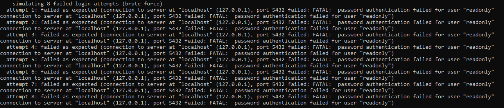
---
`test1_failed_logins_log.png`
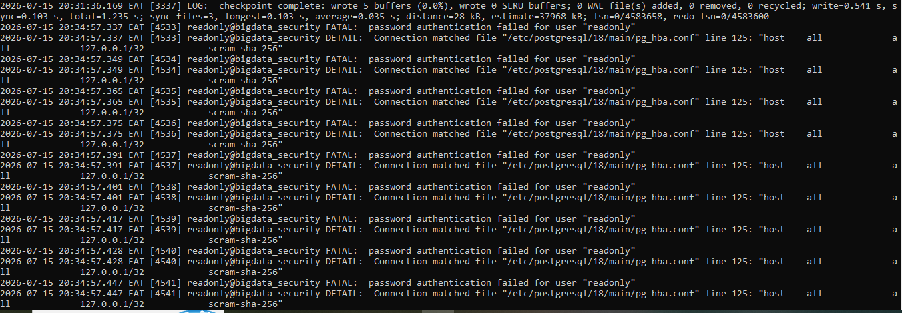
---

## Test 2: Privilege escalation blocked

- **Objective:** Verify that a non-superuser role cannot grant itself
  elevated privileges.
- **Procedure:** As the `analyst` role, ran `ALTER ROLE analyst SUPERUSER;`.
- **Expected result:** The statement should be denied, since `analyst` lacks
  the SUPERUSER attribute required to modify it.
- **Actual result:** Denied with `ERROR: permission denied to alter role` /
  `DETAIL: Only roles with the SUPERUSER attribute may change the SUPERUSER
  attribute.` The exact statement was captured in the log.
- **Evidence:** 
---
`test2_privilege_escalation_blocked.png`
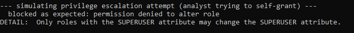
---
`test2_privilege_escalation_blocked_log.png`
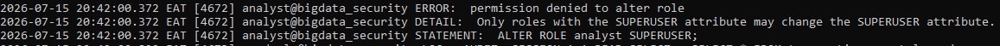
---

## Test 3: Bulk/large data export detection

- **Objective:** Verify that an unusually large, unbounded data export is
  captured by the audit log.
- **Procedure:** As the `readonly` role, ran `SELECT * FROM transactions;`
  (no `WHERE`, no `LIMIT`) against a table of 100,000 rows.
- **Expected result:** pgAudit should log the full read statement, since
  `pgaudit.log` includes `read`.
- **Actual result:** pgAudit recorded the exact statement:
  `AUDIT: SESSION,1,1,READ,SELECT,,,SELECT * FROM transactions,<not logged>`.
  Note: this required adding `read` to the `pgaudit.log` setting — the
  initial configuration (`write,ddl,role`) did not capture read-only
  queries. This gap was identified during testing and corrected (see
  Recommendations in the final report).
- **Evidence:** 
---
`test3_bulk_export_detected.png`
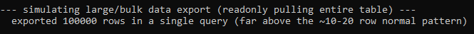
---
`test3_bulk_export_detected_log.png`
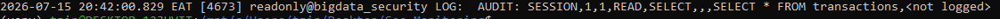
---

## Test 4: PII access restriction (RBAC enforcement)

- **Objective:** Verify that the `readonly` role cannot access raw
  personally identifiable information (email, phone, national ID) in the
  `customers` table, and is limited to the masked `customer_public` view.
- **Procedure:** As `readonly`, ran `SELECT * FROM customers;` directly.
- **Expected result:** Should be denied, since `readonly` was only granted
  `SELECT` on `customer_public` (a view excluding sensitive columns), not on
  the raw `customers` table.
- **Actual result:** Denied with `ERROR: permission denied for table
  customers`.
- **Evidence:**
--- 
`test4_pii_access_denied.png`
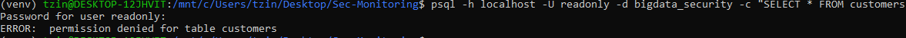
---
`test4_pii_access_denied_log.png`
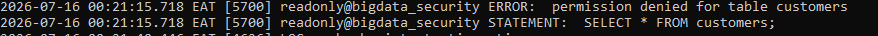
---

## Test 5: Audit logging persists across a database restart

- **Objective:** Verify that pgAudit remains active after a Postgres
  restart, rather than requiring manual re-enabling.
- **Procedure:** Ran `sudo service postgresql restart`, then inspected the
  log for confirmation that pgAudit reloaded.
- **Expected result:** The log should show `pgaudit extension initialized`
  again after the restart, with no manual intervention required.
- **Actual result:** Confirmed — `pgaudit extension initialized` appeared
  immediately after the restart, before the "ready to accept connections"
  message.
- **Evidence:** 
---
`test5_audit_survives_restart.png`
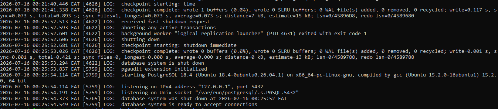
---

## Test 6: Normal vs. suspicious activity — quantified comparison

- **Objective:** Establish a quantifiable, structural distinction between
  normal and suspicious database activity, beyond a visual comparison.
- **Procedure:** Ran `scripts/simulate_normal.py` (scoped queries with
  `WHERE`/`LIMIT`, 2-20 rows returned) followed by
  `scripts/simulate_suspicious.py` (unbounded full-table query). Counted
  occurrences of failed logins and bulk-export patterns in the log via
  `grep`.
- **Expected result:** Suspicious activity should be structurally
  distinguishable from normal activity — specifically, larger row counts,
  missing `WHERE`/`LIMIT` clauses, and correlation with other anomalies
  (failed logins, privilege attempts) in the same time window.
- **Actual result:** Normal activity generated 0 failed logins and only
  small, scoped queries. Suspicious activity generated 34 logged failed
  login attempts and exactly 1 unbounded full-table query returning
  100,000 rows — a clean signal with no false positives from legitimate
  traffic. This demonstrates a detection rule such as "flag any query
  without WHERE/LIMIT returning >1000 rows" or "flag >5 failed logins in
  under 1 minute" would be effective here.
- **Evidence:** 
---
`test6_normal_vs_suspicious_comparison.png`
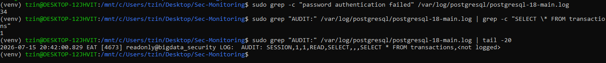
---

## Test 7: Role creation restricted to privileged users

- **Objective:** Verify that ordinary roles (not just superusers) cannot
  create new database roles — a potential backdoor-account vector if left
  unrestricted.
- **Procedure:** As `analyst`, ran `CREATE ROLE test_intruder WITH LOGIN
  PASSWORD 'x';`.
- **Expected result:** Should be denied, since `analyst` lacks the
  CREATEROLE attribute.
- **Actual result:** Denied with `ERROR: permission denied to create role`
  / `DETAIL: Only roles with the CREATEROLE attribute may create roles.`
- **Evidence:** 
---
`test7_role_creation_denied.png`
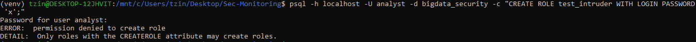

---

## Summary

| # | Test | Result |
|---|------|--------|
| 1 | Brute-force login detection | Pass |
| 2 | Privilege escalation blocked | Pass |
| 3 | Bulk data export detection | Pass (after config fix) |
| 4 | PII access restriction | Pass |
| 5 | Audit logging survives restart | Pass |
| 6 | Normal vs. suspicious comparison | Pass |
| 7 | Role creation restriction | Pass |

All 7 tests passed. One configuration gap was discovered and corrected
during testing (Test 3), demonstrating the value of active security testing
over static configuration review alone.